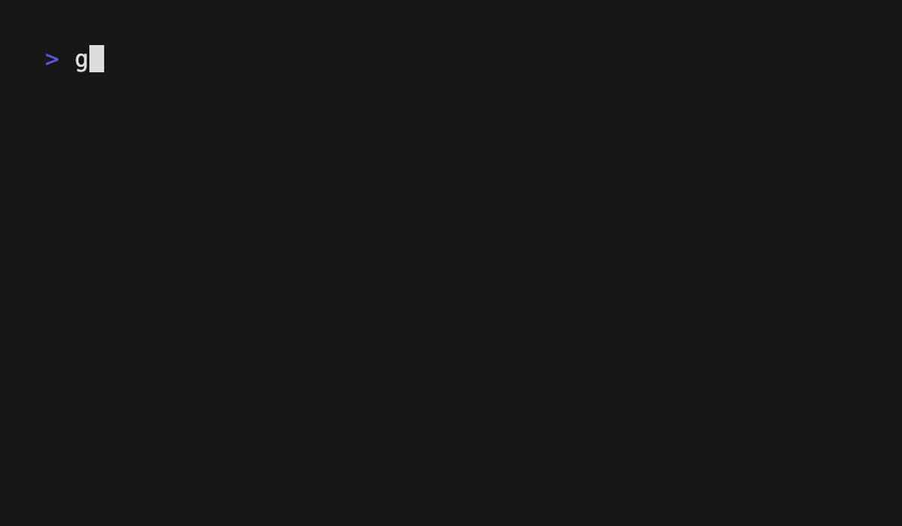

# Bubble Tea Tabs Component

A modular approach to build a tabbed interface using the [Bubble Tea](https://github.com/charmbracelet/bubbletea) framework.

## Demo



## Features
- Elegant, simple, and modular tab switching
- Independent tab state management
- Allows users to style tabs how they wish (active and inactive)

## Key Concepts

There are 2 basic components you need to be familiar with to use this effectivley:
1. `TabModel interface{}`
    - This interface is the abstraction of the actual tab.
    - It requires you to implement all methods a bubbletea model needs plus 2 others:
        - `Title()` & `SetActive()`
    - Basically, each implementation is its own tab - how you define Update() & View() will determine how the tab looks & reacts when it becomes active (more on the controller in concept #2)

        Location: `ui-components/tabsmodel.go`
        ```go
            type TabModel interface {
            // Init initializes the tab and returns an initial command.
            Init() tea.Cmd

            // Update handles incoming messages and updates the tab's state.
            // It returns the updated model and an optional command.
            Update(tea.Msg) (tea.Model, tea.Cmd)

            // View renders the tab's view as a string.
            View() string

            // Additional: Title returns the title of the tab.
            Title() string

            // Additional: SetActive handles the activation state of the tab.
            SetActive(bool)
        }
        ```

2. `TabsModel{}`
    - This Bubbletea model is the primary controller that contains all the tabs defined above.
        - It tells the `TabModel{}`s (implemented above) to initialize & update themselves as defined by the user.
    - This code should generally not be edited - it's your link between the main program and the user's implementation. Because of this, your main program is dead simple and all the logic is maintained in the user-implemented `TabModel{}` 

        Location: `ui-components/tabsmodel.go`
        ```go
        type TabsModel struct {
            tabs       []TabModel // A slice of TabModel representing the individual tabs
            active     int        // An integer representing the index of the currently active tab
            wraparound bool       // A boolean indicating whether tab navigation should wrap around

            tabStyle       lipgloss.Style // The style applied to inactive tabs
            activeTabStyle lipgloss.Style // The style applied to the active tab
        }
        ```
